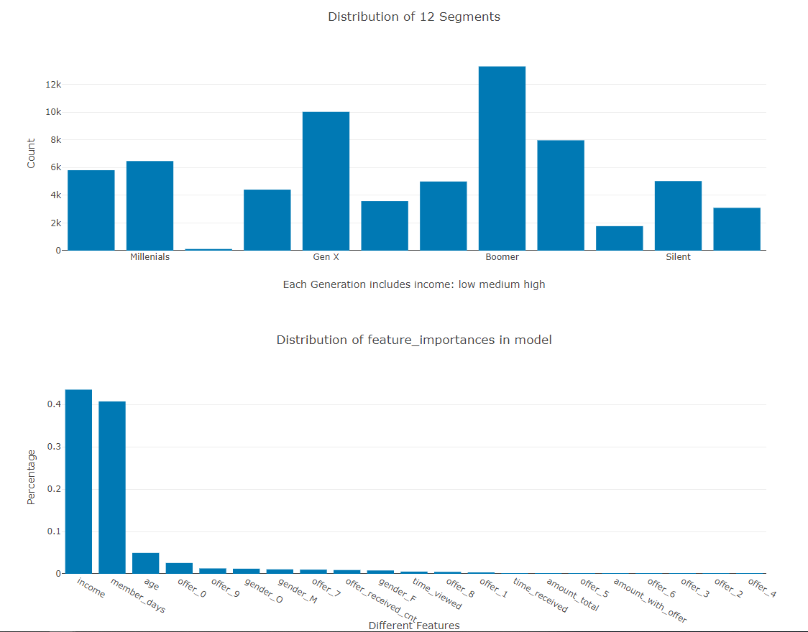
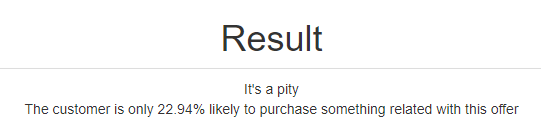

# Udacity_DSND_proj4_Starbucks Promotion

### [Table of Contents](#Start)
1. [Project Overview](#Overview)
    - [Data Set](#Data)
2. [Project Components](#Components)  
    2.1 Data Wrangling in `1_Data_Cleaning_and_Preprocessing.ipynb`  
    2.2 Data Explore with heuristic method in `2_heuristic_exploration.ipynb`  
    2.3 Data Explore with Machine Learning in `3_ML_model.ipynb`  
    2.4 Flask Web App
3. [File Description](#Files)  
    - Requirements
4. [Instructions](#Instructions)
5. [Result](#Result)  
**References**


## 1. Project Overview <a name="Overview"></a>
Once every few days, Starbucks sends out an offer to users of the mobile app. An offer can be merely an advertisement for a drink or an actual offer such as a discount or BOGO (buy one get one free).   
Some users might not receive any offer during certain weeks.  
Not all users receive the same offer.

This data set contains simulated data that mimics customer behavior on the Starbucks rewards mobile app, it's a simplified version of the real Starbucks app because the underlying simulator only has one product whereas Starbucks actually sells dozens of products.

The task is to combine transaction, demographic and offer data to determine which demographic groups respond best to which offer type.

More precisely, I aim to answer two questions:  
1. What are the main factors that driver customers or groups to complete an offer?
2. Given offer characteristics and user demographics, can we predict whether the customer will complete the offer effectively? What's more, how much money will the customer pay for?


### Data Set<a name="Data"></a>
- portfolio.json  
    containing offer ids and meta data about each offer (duration, type, etc.)
- profile.json  
    demographic data for each customer
- transcript.json  
    records for transactions, offers received, offers viewed, and offers completed. It shows user purchases made on the app including the timestamp of purchase and the amount of money spent on a purchase.


## 2. Project Components <a name="Components"></a>
### 2.1 Data Wrangling
Use the original data sets, based on a self designed program chart, I extract the transactions infomation direct to the related person and offer.   

Meantime, I wrangle the data type of some features (e.g. the 'value' column in `portfolio` is a list, should be unfolded), and transform some features to normal form(e.g. transform the member enroll date from 'int' to 'date').  

Then I divide all the customers into 12 segments according to 'age' and 'income', which tends to show a group characteristics.   

What's more important, considering all kinds of response situations to offer, I divide all transactions to 4 groups:  
- (none_offer) never received offer
- (no_care_offer) received, but don't care about the offer
- (tried_offer) tried to do some transaction, but not complete within the duration of offer
- (effective_offer) complete the offer  

Finally, I get an ideal wrangled data set with label of segments and response groups.

More details in [1_Data_Cleaning_and_Preprocessing.html](./1_Data_Cleaning_and_Preprocessing.html)

### 2.2 Data Explore with heuristic method
Using the ideal wrangled data set, based on the label of segments and response groups, I plot 4 figures, try to answer 4 questions:  
- What's the distribution of Offers: none offer VS. with offer?
- Does customers have interest towards different offers: no care VS. care(tried & effective_offer)?
- Does it difficult to complete the offer: tried_offer VS. effective_offer?
- Index IIR: is the offer significant popular?  

More details in [2_heuristic_exploration.html](./2_heuristic_exploration.html)


### 2.3 Data Explore with Machine Learning
After the heuristic exploration, I wonder whether Machine Learning will find some intersting points of the data. Especially in the following situations:
1. Offer prepared to sent to a customer, will this offer effective?
2. Offer already sent to a customer, is this offer effective?
3. Given basic infos of a customer, how to recommend an offer with the most effctivity?

To answer these questions, I build a model pipeline:
- Select features and target(for different issue concerned use different features and target)
- Select classifiers and compare the perform of all classifiers
- Select the suitable parameters of the best performed classifier by using grid search method
- Analyse the result  

**Notice:** One Neural Network is also built for regeression analysing.

More details in [3_ML_model.html](./3_ML_model.html)


### 2.4 Flask Web App
Build a Web application by using Flask framework.  
Based on a Machine Learning model which concerns the issue: Offer already sent to a customer, is this offer effective?  
Input necessary information, after submit, the Web page will return an answer after model analysing.

## 3 Files <a name="FileDescription"></a>
<pre>
Workspace:.
│  .gitignore
│  1_Data_Cleaning_and_Preprocessing.html
│  1_Data_Cleaning_and_Preprocessing.ipynb
│  2_heuristic_exploration.html
│  2_heuristic_exploration.ipynb
│  3_ML_model.html
│  3_ML_model.ipynb
│  data_preprocessing_class.py
│  LICENSE
│  model_sent_target(GradientBoosting).pckl
│  README.md
│      
├─app
│  │  run.py
│  │  
│  ├─static
│  │  └─images
│  │          github.png
│  │          starbucks.png
│  │          udacity.png
│  │          
│  └─templates
│          go.html
│          master.html
│          
├─data
│      portfolio.json
│      profile.json
│      transcript.json
│      
├─data_generated
│      model_dataset_raw.csv
│      portfolio_cleaned.csv
│      profile_cleaned.csv
│      target_dataset_wrangled.csv
│      target_dataset_wrangled_modified_.csv
│      transcript_offer_wrangled.csv
│      
├─images
│      Distribution of income.png
│      Distribution of the Segments with age & income.png
│      flow_chart.jpg
│      generations_age.png
│      model_dataset.png
│      offer_info.png
│      pred_result.png
│      result.png
│      segment.png
│      segment_group.png
│      target_dataset.png
│      tax.png
│      The Distribution of Interest.png
│      transcript_offer.png   

</pre>


- **Requirements**
There is no requirements for any special Modules.


## 4. Instructions <a name="Instructions"></a>
1. Run the following command in the app's directory to run your web app.
    ```python
    python run.py
    ```

2. Go to http://localhost:3001

3. Input the infomation and submit, until the Web page returns an result.


## 5. Result: <a name="Result"></a>
1. Distribution of 12 segments based on 'age' & 'income'  


2. Predict result  


# References
[[1]Create dummies from a column with multiple values in pandas](https://intellipaat.com/community/32880/create-dummies-from-a-column-with-multiple-values-in-pandas)<br>
[[2]Starbucks Capstone Challenge: Using Starbucks app user data to predict effective offers](https://github.com/syuenloh/UdacityDataScientistCapstone/blob/master/Starbucks%20Capstone%20Challenge%20-%20Using%20Starbucks%20app%20user%20data%20to%20predict%20effective%20offers.ipynb)<br>
[[3]Starbucks Promotion Optimization](https://towardsdatascience.com/starbucks-promotion-optimization-ca56e29fb584)<br>
[[4]generations-and-age](https://www.pewresearch.org/topics/generations-and-age/)<br>
[[5]single taxable income](https://en.wikipedia.org/wiki/Income_tax_in_the_United_States#Marginal_tax_rates_for_2019)<br>
[[6]Starbucks Capstone Challenge: Using Starbucks app user data to predict effective offers](https://github.com/syuenloh/UdacityDataScientistCapstone/blob/master/Starbucks%20Capstone%20Challenge%20-%20Using%20Starbucks%20app%20user%20data%20to%20predict%20effective%20offers.ipynb)<br>
