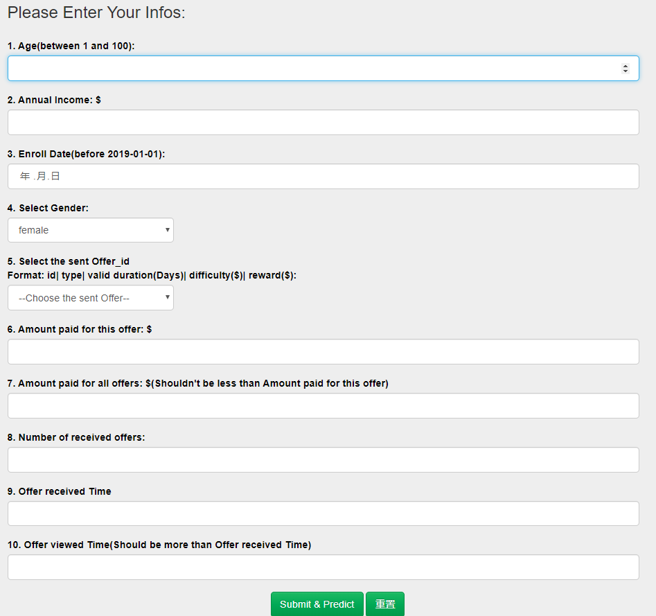
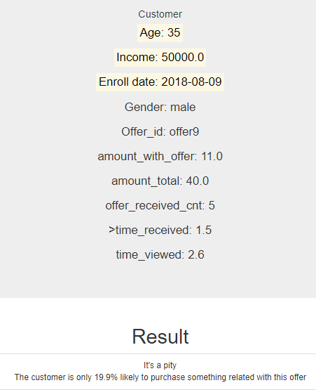

# Udacity_DSND_proj4_Starbucks Promotion

### [Table of Contents](#Start)
1. [Project Overview](#Overview)
    - [Data Set](#Data)
2. [Project Components](#Components)  
    2.1 Data Wrangling in `1_Data_Cleaning_and_Preprocessing.ipynb`  
    2.2 Data Explore with heuristic method in `2_heuristic_exploration.ipynb`  
    2.3 Data Explore with Machine Learning in `3_ML_model.ipynb`  
    2.4 Flask Web App
3. [File Description](#Files)  
    - Requirements
4. [Instructions](#Instructions)
5. [Result](#Result)  
**References**


## 1. Project Overview <a name="Overview"></a>
Once every few days, Starbucks sends out an offer to users of the mobile app. An offer can be merely an advertisement for a drink or an actual offer such as a discount or BOGO (buy one get one free).   
Some users might not receive any offer during certain weeks.  
Not all users receive the same offer.

This data set contains simulated data that mimics customer behavior on the Starbucks rewards mobile app, it's a simplified version of the real Starbucks app because the underlying simulator only has one product whereas Starbucks actually sells dozens of products.

The task is to combine transaction, demographic and offer data to determine which demographic groups respond best to which offer type.

More precisely, I aim to answer two questions:  
1. What are the main factors that driver customers or groups to complete an offer?
2. Given offer characteristics and user demographics, can we predict whether the customer will complete the offer effectively? What's more, how much money will the customer pay for?


### Data Set<a name="Data"></a>
- portfolio.json  
    containing offer ids and meta data about each offer (duration, type, etc.)
    | Columns | Data Type | Explanation | Total Count | NaN Count |
    |:-|:-|:-|:-|:-|
    | id | str | id of offer | 10 | - |
    | offer_type | str | type of offer<br>**values:** 'bogo','discount','informational' | 10 | - |
    | difficulty | int | the minimum consumption to complete the offer | 10 |-  |
    | reward | int | reward after completing the offer | 10 | - |
    | duration | int | the valid duration of the offer | 10 | - |
    | channels | str list | the channel to send the offer  | 10 | - |
- profile.json  
    demographic data for each customer
    | Columns | Data Type | Explanation | Total Count | NaN Count |
    |:-|:-|:-|:-|:-|
    | age | int | the age of customer | 14825 | 2175 |
    | became_member_on | int | the enroll date of customer<br>e.g. 20170101 | 17000 | - |
    | gender | str | the gender of customer<br>**values:**'male','female','other' | 17000 | - |
    | id | str | the id of customer | 17000 | - |
    | income | float | the income of customer | 14825 | 2175 |

- transcript.json  
    records for transactions, offers received, offers viewed, and offers completed. It shows user purchases made on the app including the timestamp of purchase and the amount of money spent on a purchase.
    | Columns | Data Type | Explanation | Total Count | NaN Count |
    |:-|:-|:-|:-|:-|
    | person | str | the id of customer | 306534 | - |
    | event | str | the description of transcript<br>**values:**'offer received','offer viewed','transaction','offer completed' | 306534 | - |
    | time | int | the happend time of event(hour) | 306534 | - |
    | value | str dict | some includes id of offer, some includes amount of transaction | 306534 | - |


## 2. Project Components <a name="Components"></a>
### 2.1 Data Wrangling
By using the original data sets, based on a self designed program flow chart([File:data_preprocessing_class.py](./data_preprocessing_class.py)), I extract the transactions infomation direct to the related person and offer.   

Meantime, I wrangle the data type of some features (e.g. the 'value' column in `portfolio` is a list, should be unfolded), and transform some features to normal form(e.g. transform the member enroll date from 'int' to 'date').  

More details in [1_Data_Cleaning_and_Preprocessing.ipynb](./1_Data_Cleaning_and_Preprocessing.ipynb)

Then I divide all the customers into 12 segments according to 'age' and 'income', which tends to show a group characteristics.   

What's more important, considering all kinds of response situations to offer, I divide all transactions to 4 groups:  
- (none_offer) never received offer
- (no_care_offer) received, but don't care about the offer
- (tried_offer) tried to do some transaction, but not complete within the duration of offer
- (effective_offer) complete the offer  

Finally, I get an ideal wrangled data set with label of segments and response groups described as follows([File: model_dataset](./data_generated/model_dataset_raw.csv)):  

|Column|Type|Explanation|Total Count|NaN Count|
|:-|:-|:-|:-|:-|
| person | int | id of customer | 66506 | - |
| offer_id | str object | values: '-1', '0'-'9'<br> represent 10 offers,  '-1'means no offer received | 66506 | - |
| time_received | float | time when offer received<br>'NaN' represents not received | 66506 | 5 |
| time_viewed | float | time when offer viewed<br>'NaN' represents not viewed | 66506 | 16646 |
| time_transaction | str object | time then transaction(s) takes place<br>'' represents there is no transaction<br>',3.0,5.0' means there are two transactions under this offer, one is at time 3.0, another in at time 5.0 | 66506 | 8754 |
| time_completed | float | time when offer completed<br>'NaN' represents not completed | 66506 | 26099 |
| amount_with_offer| float | How much money has been paid under this offer<br>'0.0' represent no transaction | 66506|-|
| label_effective_offer| int | the label to mark the completing level of offer<br>**More details See Notice below** | 66506 | - |
| reward | float| Reward after completing the offer| 66501 | 5 |
| difficulty | float| The minimum consumption to complete the offer| 66501 | 5 |
| duration | float| The valid duration of the offer<br>'NaN' implies the offer_id is '-1'| 66501 | 5 |
| offer_type | str object| 'bogo', 'discount','informational'| 66501 | 5 |
| email | float| One Channel to send offer| 66501 | 5 |
| mobile | float| One Channel to send offer| 66501 | 5 |
| social | float| One Channel to send offer| 66501 | 5 |
| web | float| One Channel to send offer| 66501 | 5 |
| gender | str object| 'male','female','other'| 66506 | - |
| age | int| Age of the customer| 66506 | - |
| income | float| Yearly income of the customer| 66506 | - |
| member_days | int| The days from enroll date to 2019.01.01| 66506 | - |
| label_group | str object| 4 groups of resonse to offers<br>Values **see Notice2. below**| 66506 | - |
| label_seg | int| 1-12: 12 segments based on age and income| 66506 | - |

<br>  

**Notice 1.: label_effective_offer** (Label describes the completed level of offer)  
**(Attention: there is no infomation about 'offer viewed')**  

|Values|Meaning|
|:-|:-|
| 1 | for informational offer there is at least one transaction within duration;<br>for other offer there should be 'offer completed' |
| 0 | for informational offer there is no valid transaction within the duration but 'offer received'; <br> for other offers there is no 'offer completed', but within duration there maybe some amount, although the amount of transactions not fulfil requirements|
| -1 | the initial label, when there is no 'offer received', the label keeps '-1' |
| -2 | represent some people: they only have transactions within all the experimantal time , no offer was sent to them |

<br>  

**Notice 2.: label_group** (4 groups of resonse to offers)

|Group| received | viewed |valid completed | transaction amount |Scenario | Logical expression |
| :-| :-: | :-:| :-: | :-: | :- |:-|
|1.none_offer| 0 | 0 | 0 | |haven't received the offer |label_effective_offer.isin([-1, -2])<br>& time_viewed == NaN|
|2.no_care | 1 | 0 | - | |received but not viewed.<br> regarded as "don't care"|label_effective_offer.isin([0, 1])<br>& time_viewed == NaN|
|| 1 | 1 | 0 | =0.0 | received, viewed but no transaction |label_effective_offer == 0<br>& amount == 0.0 <br>& time_viewed.notnull()|
|| 1 | 1 | 1<br>viewed after completed |  | received, but completed unintentionally, namely viewing after completed |label_effective_offer == 1 <br>& time_viewed > time_completed|
|3.tried| 1 | 1 | 0 | >0.0|received, viewed, have transaction, but amount less than 'difficulty' |label_effective_offer == 0 <br>& amount > 0.0 <br>& time_viewed.notnull()|
|4.effctive_offer | 1 | 1 | 1<br>viewed before completed | | viewed before completed,  effctive offer|label_effective_offer == 1 <br>& time_viewed < time_completed|


**Notice 3.: label_seg**  (12 segments based on age and income)

|Segment #| Age Group (edge included)<br> (Experiment in 2018) | Income |
|---| --- | --- |
|1| Millenials(-21 & 22-37) | low  |
|2| Millenials(-21 & 22-37) | medium  |
|3| Millenials(-21 & 22-37) | high  |
|4| Gen X(38-53) | low  |
|5| Gen X(38-53) | medium |
|6| Gen X(38-53) | high |
|7| Baby Boomer(54-72) | low  |
|8| Baby Boomer(54-72) | medium |
|9| Baby Boomer(54-72) | high |
|10| Silent(73-90 & 91+) |low |
|11| Silent(73-90 & 91+) | medium |
|12| Silent(73-90 & 91+) | high |

Income Level:

|Income| Values($)|
| :- | :- |
| low | 30,000-50,000|
| medium | 50,001-82,500|
| high | 82,501-120,000|

<br>  

**Notice 4.: offer_id**  (10 Kinds of offer)

| offer_id| type | duration | requirement | reward |
|:-| :-| :-:|:-:|:-:|
| 0 | bogo | 7 | 10 | 10 |
| 1 | bogo | 5 | 10 | 10 |
| 2 | infomational | 4 | - | - |
| 3 | bogo | 7 | 5 | 5 |
| 4 | discount | 10 | 20 | 5 |
| 5 | discount | 7 | 7 | 3 |
| 6 | discount | 10 | 10 | 2 |
| 7 | informational | 3 | - | - |
| 8 | bogo | 5 | 5 | 5 |
| 9 | discount | 7 | 10 | 2 |


### 2.2 Data Explore with heuristic method
Using the ideal wrangled data set, based on the label of segments and response groups, I plot 4 figures, try to answer 4 questions:  
- What's the distribution of Offers: none offer VS. with offer?
- Does customers have interest towards different offers: no care VS. care(tried & effective_offer)?
- Does it difficult to complete the offer: tried_offer VS. effective_offer?
- Index IIR: is the offer significant popular?  

More details in [2_heuristic_exploration.ipynb](./2_heuristic_exploration.ipynb)


### 2.3 Data Explore with Machine Learning
After the heuristic exploration, I wonder whether Machine Learning will find some intersting points of the data. Especially in the following situations:
1. Offer prepared to sent to a customer, will this offer effective?
2. Offer already sent to a customer, is this offer effective?
3. Given basic infos of a customer, how to recommend an offer with the most effctivity?

To answer these questions, I build a model pipeline:
- Select features and target(for different issue concerned use different features and target)
- Select classifiers and compare the perform of all classifiers
- Select the suitable parameters of the best performed classifier by using grid search method
- Analyse the result  

**Notice:** One Neural Network is also built for regeression analysing.

More details in [3_ML_model.ipynb](./3_ML_model.ipynb)


### 2.4 Flask Web App
Build a Web application by using Flask framework.  
Based on a Machine Learning model which concerns the issue: **Offer already sent to a customer, is this offer effective?**   
- Open the website following the instructions below
- Input necessary information and submit
- The Web page will return an answer after model analysing.

## 3 Files <a name="FileDescription"></a>
<pre>
Workspace:.
│  .gitignore
│  1_Data_Cleaning_and_Preprocessing.html
│  1_Data_Cleaning_and_Preprocessing.ipynb
│  2_heuristic_exploration.html
│  2_heuristic_exploration.ipynb
│  3_ML_model.html
│  3_ML_model.ipynb
│  data_preprocessing_class.py
│  LICENSE
│  model_sent_target(GradientBoosting).pckl
│  project report.pdf
│  README.md
│  test.ipynb
│  
├─.ipynb_checkpoints
│      1_Data_Cleaning_and_Preprocessing-checkpoint.ipynb
│      2_heuristic_exploration-checkpoint.ipynb
│      3_ML_model-checkpoint.ipynb
│      test-checkpoint.ipynb
│      
├─app
│  │  run.py
│  │  
│  ├─static
│  │  └─images
│  │          github.png
│  │          starbucks.png
│  │          udacity.png
│  │          
│  └─templates
│          go.html
│          master.html
│          
├─data
│      portfolio.json
│      profile.json
│      transcript.json
│      
├─data_generated
│      model_dataset_raw.csv
│      portfolio_cleaned.csv
│      profile_cleaned.csv
│      target_dataset_wrangled.csv
│      target_dataset_wrangled_modified.csv
│      transcript_offer.csv
│      transcript_offer_wrangled.csv
│      
└─images
        Difficulty_Distributions.png
        Distribution of income.png
        Distribution of the Segments with age & income.png
        flow_chart.jpg
        generations_age.png
        IIR.png
        Interest_Distributions.png
        model_dataset.png
        Offer_Distributions.png
        offer_info.png
        result.png
        result_pred.png
        result_submit.png
        segment.png
        segment_group.png
        target_dataset.png
        tax.png
        The Distribution of Interest.png
        transcript_offer.png
</pre>

- project report.pdf
The quick and clear overview of this project.

- **Requirements**
There is no requirements for any special Modules.


## 4. Instructions <a name="Instructions"></a>
1. Run the following command in the app's directory to run your web app.
    ```python
    python run.py
    ```

2. Go to http://localhost:3001

3. Input the infomation and submit, until the Web page returns an result.


## 5. Result: <a name="Result"></a>
1. Distribution of 12 segments based on 'age' & 'income'  


2. Input infomation for predicting


3. Model predict result  


# References
[[1]Create dummies from a column with multiple values in pandas](https://intellipaat.com/community/32880/create-dummies-from-a-column-with-multiple-values-in-pandas)<br>
[[2]Starbucks Capstone Challenge: Using Starbucks app user data to predict effective offers](https://github.com/syuenloh/UdacityDataScientistCapstone/blob/master/Starbucks%20Capstone%20Challenge%20-%20Using%20Starbucks%20app%20user%20data%20to%20predict%20effective%20offers.ipynb)<br>
[[3]Starbucks Promotion Optimization](https://towardsdatascience.com/starbucks-promotion-optimization-ca56e29fb584)<br>
[[4]generations-and-age](https://www.pewresearch.org/topics/generations-and-age/)<br>
[[5]single taxable income](https://en.wikipedia.org/wiki/Income_tax_in_the_United_States#Marginal_tax_rates_for_2019)<br>
[[6]Investigating Starbucks Customers Segmentation using Unsupervised Machine Learning](https://medium.com/@jeffrisandy/investigating-starbucks-customers-segmentation-using-unsupervised-machine-learning-10b2ac0cfd3b)<br>
